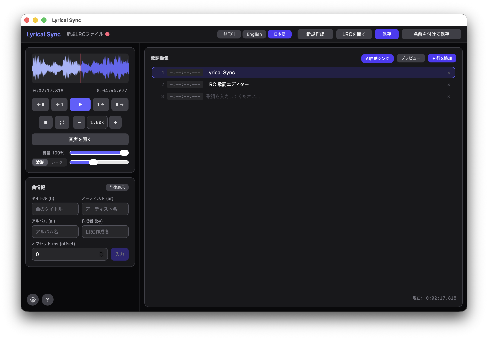

# Lyrical Sync

`.lrc` (LRC) 歌詞ファイルを作成・編集するデスクトップアプリ

[English](README.md) | [한국어](README.ko.md)




---

## 機能

### コア機能
- **波形 & シークバー** — Wavesurfer.js でオーディオを波形表示、ホバー時刻ツールチップ・ドラッグシーク・残り時間トグルを備えたシークバーに切り替え可能
- **リアルタイムタイムスタンプ** — `Space` を押して現在の再生位置を歌詞行にスタンプし、次の行へ自動移動
- **歌詞エディター** — 行の追加・編集・削除、複数行テキストの一括貼り付けに対応
- **プレビューモード** — 自動スクロールハイライト・歌詞クリックシーク・インラインタイムスタンプ編集を備えたカラオケ風全画面プレビュー
- **オフセット調整** — ミリ秒単位のオフセット値で全タイムスタンプを一括シフト
- **Raw LRC エディター** — 「全体表示」ポップアップで LRC ファイル全体をテキストとして確認・編集
- **楽曲メタデータ** — タイトル・アーティスト・アルバム・作成者・オフセット・追加 LRC タグを編集（読み込み/保存時に保持）
- **再生コントロール** — 0.25×〜2.0× の再生速度調整、ループ再生、音量・ズームスライダー

### AI 自動同期
- **自動歌詞アライメント** — [ctc-forced-aligner](https://github.com/MahmoudAshraf97/ctc-forced-aligner)（CTC 強制アライメント）でオーディオに歌詞を自動対応付け
- **1130 言語対応** — MMS-300M 多言語モデルを使用し、日本語・英語・韓国語など幅広い言語をサポート
- **ボーカル分離** — アライメント前に [Demucs](https://github.com/facebookresearch/demucs) でボーカルを分離し精度を向上（任意）
- **信頼度表示** — アライメント結果の各行を信頼度に応じて色分けし、不確かな箇所をひと目で確認
- **空白行処理** — 区切り用の空白行にも前後の歌詞を基準にタイムスタンプを自動付与
- **内蔵 Python ランタイム** — アプリが専用の Python 環境を自動ダウンロード・管理するため、システムへの Python インストール不要

### 一般
- **多言語 UI** — 日本語、韓国語、英語
- **自動アップデート通知** — 起動時に新バージョンの有無を自動確認
- **UI スケール調整** — 70%〜130% の範囲でインターフェースサイズを変更可能
- **対応オーディオ形式** — MP3, FLAC, WAV, OGG, Opus, M4A/AAC, AIFF/AIF
  - macOS（WKWebView）: すべての形式をネイティブでサポート
  - Windows（WebView2）: AIFF/AIF ファイルは Rust バックエンドで自動的に WAV へトランスコード

---

## インストール

### macOS

[Releases](../../releases) ページから最新の `.dmg` ファイルをダウンロードし、Lyrical Sync をアプリケーションフォルダーへドラッグしてください。

> **未署名アプリの警告**
>
> インストール後、ターミナルで以下のコマンドを実行してください:
>
> ```bash
> xattr -cr /Applications/Lyrical\ Sync.app
> ```
>
> その後、通常通りアプリを起動できます。

### Windows

[Releases](../../releases) ページから最新の `.msi` または `_x64-setup.exe` インストーラーをダウンロードして実行してください。

> **SmartScreen の警告**
>
> Windows Defender SmartScreen に「発行元不明」の警告が表示された場合は、**詳細情報** → **実行**をクリックしてインストールを進めてください。

---

## キーボードショートカット

| キー | 操作 |
|------|------|
| `1` | −5秒スキップ |
| `2` | −1秒スキップ |
| `3` | 再生 / 一時停止 |
| `4` | +1秒スキップ |
| `5` | +5秒スキップ |
| `6` | 停止して最初（0:00）へ |
| `Space` | 現在行にタイムスタンプ + 次の行へ移動 |
| `Backspace` | 前の行へ移動 |

> 入力フィールドにフォーカス中はショートカットが無効になります。

---

## 技術スタック

| 役割 | 技術 | バージョン |
|------|------|-----------|
| デスクトップフレームワーク | Tauri | v2 |
| フロントエンド | React + TypeScript | React 19, TS 5.8 |
| スタイリング | Tailwind CSS + @tailwindcss/vite | v4 |
| 状態管理 | Zustand | v5 |
| 波形表示 | Wavesurfer.js | v7 |
| AI アライメント | ctc-forced-aligner + MMS-300M | — |
| ボーカル分離 | Demucs htdemucs | — |
| ファイル I/O | @tauri-apps/plugin-fs | v2 |
| ダイアログ | @tauri-apps/plugin-dialog | v2 |

---

## 開発を始める

### 前提条件

- [Node.js](https://nodejs.org/) 18+
- [Rust](https://www.rust-lang.org/tools/install)（stable）
- Tauri CLI の依存関係 — [Tauri の前提条件](https://v2.tauri.app/start/prerequisites/)を参照

```bash
npm install
npm run tauri dev   # 開発サーバー起動
npm run tauri build # リリースビルド
npx tsc --noEmit    # 型チェック
```

ビルド成果物は `src-tauri/target/release/bundle/` に出力されます。
