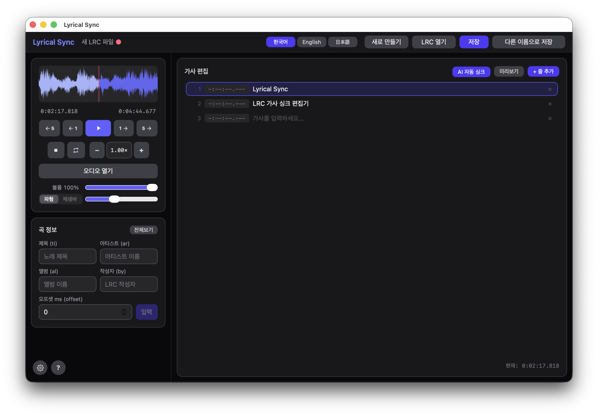

# Lyrical Sync

`.lrc` (LRC) 가사 파일을 생성하고 편집하는 데스크톱 앱

[English](README.md) | [日本語](README.ja.md)




---

## 기능

- **파형 재생** — Wavesurfer.js로 오디오를 시각화하고 키보드 단축키로 재생 제어
- **실시간 타임스탬프 스탬핑** — `Space`를 눌러 현재 재생 위치로 활성 가사 줄에 타임스탬프를 찍고 다음 줄로 자동 이동
- **가사 편집기** — 가사 줄 추가, 편집, 순서 변경, 삭제; 여러 줄 텍스트 붙여넣기로 한 번에 여러 줄 삽입
- **미리보기 모드** — 자동 스크롤 하이라이트와 인라인 타임스탬프 편집을 지원하는 가라오케 스타일 전체화면 미리보기
- **오프셋 조정** — 밀리초 단위 오프셋 값으로 전체 타임스탬프를 일괄 조정
- **Raw LRC 편집기** — "전체보기" 팝업으로 전체 LRC 파일을 텍스트로 확인하고 편집
- **곡 메타데이터** — 제목, 아티스트, 앨범, 작성자, 오프셋, 추가 LRC 태그 편집 (불러오기/저장 시 보존)
- **다국어 UI** — 한국어, 영어, 일본어
- **지원 오디오 포맷** — MP3, FLAC, WAV, M4A/AAC, AIFF/AIF
  - macOS (WKWebView): 모든 포맷 네이티브 지원
  - Windows (WebView2): AIFF/AIF 파일은 Rust 백엔드에서 자동으로 WAV로 트랜스코딩하여 재생

## 설치

### macOS

[Releases](../../releases) 페이지에서 최신 `.dmg` 파일을 다운로드한 후, 열어서 Lyrical Sync를 응용 프로그램 폴더로 드래그하세요.

> **macOS — 미서명 앱 경고**
>
> 설치 후 터미널에서 아래 명령어를 실행하세요:
>
> ```bash
> xattr -cr /Applications/Lyrical\ Sync.app
> ```
>
> 이후 앱을 정상적으로 실행하면 됩니다.

### Windows

[Releases](../../releases) 페이지에서 최신 `.msi` 또는 `_x64-setup.exe` 설치 파일을 다운로드한 후 실행하세요.

> **Windows — 보안 경고**
>
> Windows Defender SmartScreen에서 "알 수 없는 게시자" 경고가 표시되면 **추가 정보** → **실행**을 클릭하여 설치를 진행하세요.

## 키보드 단축키

| 키 | 동작 |
|----|------|
| `1` | −5초 스킵 |
| `2` | −1초 스킵 |
| `3` | 재생 / 일시정지 |
| `4` | +1초 스킵 |
| `5` | +5초 스킵 |
| `6` | 정지 및 처음(0:00)으로 |
| `Space` | 현재 줄 스탬프 + 다음 줄로 이동 |
| `Backspace` | 이전 줄로 이동 |

> 입력 필드에 포커스가 있는 동안에는 단축키가 비활성화됩니다.

## 기술 스택

| 역할 | 기술 | 버전 |
|------|------|------|
| 데스크톱 프레임워크 | Tauri | v2 |
| 프론트엔드 | React + TypeScript | React 19, TS 5.8 |
| 스타일링 | Tailwind CSS + @tailwindcss/vite | v4 |
| 상태 관리 | Zustand | v5 |
| 파형 시각화 | Wavesurfer.js | v7 |
| 파일 I/O | @tauri-apps/plugin-fs | v2 |
| 다이얼로그 | @tauri-apps/plugin-dialog | v2 |

## 시작하기

### 사전 요구사항

- [Node.js](https://nodejs.org/) 18+
- [Rust](https://www.rust-lang.org/tools/install) (stable)
- Tauri CLI 의존성 — [Tauri 사전 요구사항](https://v2.tauri.app/start/prerequisites/) 참고

### 개발 실행

```bash
npm install
npm run tauri dev
```

### 빌드

```bash
npm run tauri build
```

빌드 결과물은 `src-tauri/target/release/bundle/`에 출력됩니다.

### 타입 검사

```bash
npx tsc --noEmit
```
