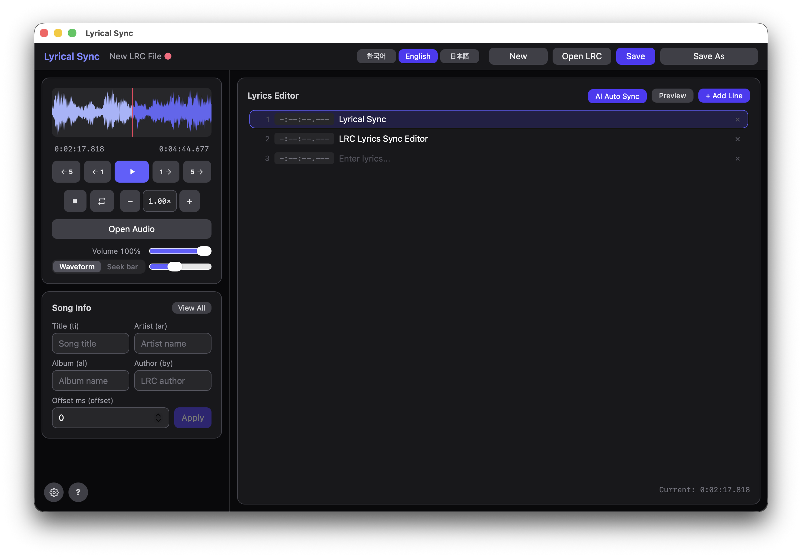

# Lyrical Sync

A desktop application for creating and editing `.lrc` (LRC) lyric files

[한국어](README.ko.md) | [日本語](README.ja.md)




---

## Features

### Core
- **Waveform & seek bar** — visualize audio with Wavesurfer.js; switch between waveform view and a sleek seek bar with hover tooltip, drag-to-seek, and remaining-time toggle
- **Real-time timestamp stamping** — press `Space` to stamp the active lyric line with the current playback position and auto-advance to the next line
- **Lyrics editor** — add, edit, and delete lyric lines; paste multi-line text to split into multiple lines at once
- **Preview mode** — karaoke-style full-screen preview with auto-scrolling highlight, click-to-seek on any lyric line, and inline timestamp editing
- **Offset adjustment** — bulk-shift all timestamps by a millisecond offset value
- **Raw LRC editor** — view and edit the full LRC file as plain text via the "View All" popup
- **Song metadata** — edit title, artist, album, author, offset, and any extra LRC tags (preserved on load/save)
- **Playback controls** — adjustable playback speed (0.25×–2.0×), loop toggle, volume and zoom sliders

### AI Auto Sync
- **Automatic lyric alignment** — aligns lyric lines to audio using [ctc-forced-aligner](https://github.com/MahmoudAshraf97/ctc-forced-aligner) (CTC forced alignment)
- **1130-language support** — powered by the MMS-300M multilingual model; works with Korean, English, Japanese, and many more
- **Vocal separation** — optionally runs [Demucs](https://github.com/facebookresearch/demucs) to isolate vocals before alignment for better accuracy
- **Confidence display** — each aligned line is color-coded by alignment confidence so you can spot uncertain results at a glance
- **Blank line handling** — blank separator lines receive timestamps automatically based on surrounding lyrics
- **Self-contained Python runtime** — the app downloads and manages its own embedded Python environment; no system Python required

### General
- **Multi-language UI** — Korean, English, Japanese
- **Auto-update check** — notifies you when a new version is available on startup
- **UI scale** — adjustable interface scale from 70% to 130%
- **Supported audio formats** — MP3, FLAC, WAV, OGG, Opus, M4A/AAC, AIFF/AIF
  - macOS (WKWebView): all formats natively supported
  - Windows (WebView2): AIFF/AIF files are automatically transcoded to WAV via the Rust backend

---

## Installation

### macOS

Download the latest `.dmg` installer from the [Releases](../../releases) page and drag Lyrical Sync into your Applications folder.

> **Unsigned app warning**
>
> Run the following command in Terminal after installation:
>
> ```bash
> xattr -cr /Applications/Lyrical\ Sync.app
> ```
>
> Then open the app normally.

### Windows

Download the latest `.msi` or `_x64-setup.exe` installer from the [Releases](../../releases) page and run it.

> **SmartScreen warning**
>
> If Windows Defender SmartScreen shows an "Unknown publisher" warning, click **More info** → **Run anyway**.

---

## Keyboard Shortcuts

| Key | Action |
|-----|--------|
| `1` | Skip −5 s |
| `2` | Skip −1 s |
| `3` | Play / Pause |
| `4` | Skip +1 s |
| `5` | Skip +5 s |
| `6` | Stop and reset to 0:00 |
| `Space` | Stamp current line + move to next |
| `Backspace` | Move to previous line |

> Shortcuts are disabled while an input field is focused.

---

## Tech Stack

| Role | Technology | Version |
|------|-----------|---------|
| Desktop framework | Tauri | v2 |
| Frontend | React + TypeScript | React 19, TS 5.8 |
| Styling | Tailwind CSS + @tailwindcss/vite | v4 |
| State management | Zustand | v5 |
| Waveform | Wavesurfer.js | v7 |
| AI alignment | ctc-forced-aligner + MMS-300M | — |
| Vocal separation | Demucs htdemucs | — |
| File I/O | @tauri-apps/plugin-fs | v2 |
| Dialogs | @tauri-apps/plugin-dialog | v2 |

---

## Getting Started (Development)

### Prerequisites

- [Node.js](https://nodejs.org/) 18+
- [Rust](https://www.rust-lang.org/tools/install) (stable)
- Tauri CLI dependencies — see [Tauri prerequisites](https://v2.tauri.app/start/prerequisites/)

```bash
npm install
npm run tauri dev   # development
npm run tauri build # production build
npx tsc --noEmit    # type check
```

Build output is placed in `src-tauri/target/release/bundle/`.
